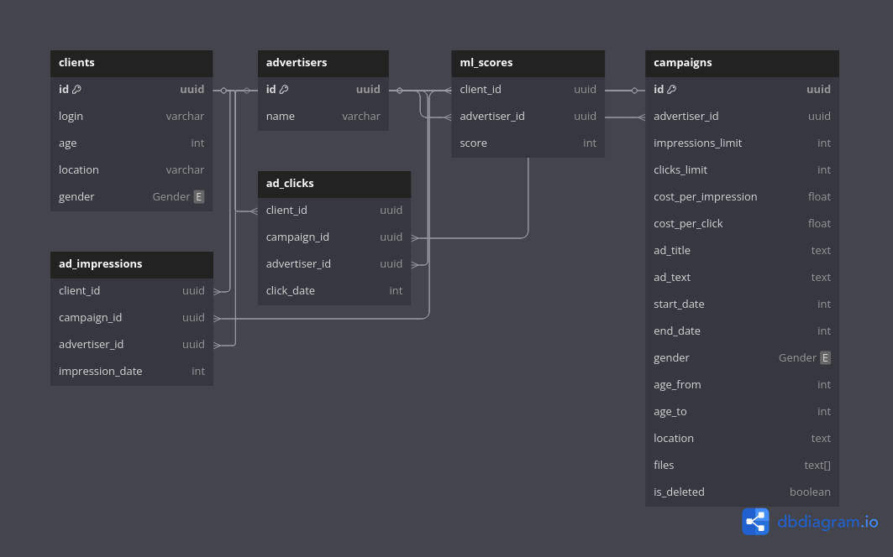

# PROD

Установка и запуск происходят через docker. Для простоты использования в проекте есть Makefile, который содержит все необходимые команды.

### Установка
```bash
make docker-build
```

### Запуск
```bash
make up
```

## Документация API
Документация в формате OpenAPI находится в файле `./docs/openapi.yaml`.
Реализованы все обязательные функции + есть интеграция с YandexGPT для модерации рекламных объявлений, + реализована возможность добавления фотографий к объявлению и их хранение в s3.

## Схема базы данных

